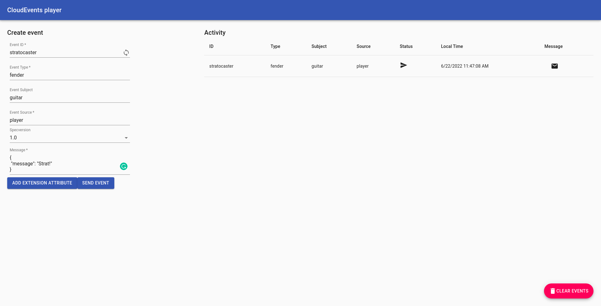

# KNative / Serverless

The following write-up was run in an OpenShift v4.10.16 cluster.

## Deploying OpenShift Serverless

1. Logged as cluster admin and using [tasty](https://github.com/karmab/tasty) we will deploy the Serverless operator into our OpenShift cluster:

    ~~~sh
    tasty install serverless-operator
    ~~~

2. We will get three pods running in the `openshift-operators` namespace:

    ~~~sh
    oc -n openshift-operators get pods
    NAME                                         READY   STATUS    RESTARTS   AGE
    knative-openshift-5c68df4fb6-l46mg           1/1     Running   0          52s
    knative-openshift-ingress-7947985ccb-47f2r   1/1     Running   0          52s
    knative-operator-58c4bcf7f7-mxpl4            1/1     Running   0          52s
    ~~~

3. Now we need to deploy the Knative components we want to use, in our case we will be using `Knative Serving` and `Knative Eventing`, let's get them deployed:

    ~~~sh
    cat <<EOF | oc apply -f -
    apiVersion: operator.knative.dev/v1alpha1
    kind: KnativeServing
    metadata:
      name: knative-serving
      namespace: knative-serving
    spec: {}
    ---
    kind: KnativeEventing
    apiVersion: operator.knative.dev/v1alpha1
    metadata:
      name: knative-eventing
      namespace: knative-eventing
    spec: {}
    EOF
    ~~~

4. Several pods will be running on both namespaces:

    ~~~sh
    oc -n knative-serving get pods
    NAME                                                 READY   STATUS      RESTARTS   AGE
    activator-548d6fd8f6-4t6lg                           2/2     Running     0          99s
    activator-548d6fd8f6-d96dh                           2/2     Running     0          99s
    autoscaler-7577cc875c-7g94j                          2/2     Running     0          99s
    autoscaler-7577cc875c-khql9                          2/2     Running     0          99s
    autoscaler-hpa-559ff79c67-2k9p4                      2/2     Running     0          96s
    autoscaler-hpa-559ff79c67-czs7n                      2/2     Running     0          96s
    controller-5f95b77fd6-4lsvg                          2/2     Running     0          48s
    controller-5f95b77fd6-rsjch                          2/2     Running     0          89s
    domain-mapping-65645f4697-4d7hx                      2/2     Running     0          98s
    domain-mapping-65645f4697-rgmdf                      2/2     Running     0          98s
    domainmapping-webhook-5c99d58dd7-fdlnb               2/2     Running     0          98s
    domainmapping-webhook-5c99d58dd7-w295l               2/2     Running     0          98s
    strg-version-migration-serving-serving-1.1.2-dpfjv   0/1     Completed   0          96s
    webhook-6c8d66489-4xqgq                              2/2     Running     0          97s
    webhook-6c8d66489-xw6hd                              2/2     Running     0          97s

    oc -n knative-eventing get pods
    NAME                                                   READY   STATUS      RESTARTS   AGE
    eventing-controller-7c9d7879f-g8c5s                    2/2     Running     0          119s
    eventing-controller-7c9d7879f-qsb7s                    2/2     Running     0          119s
    eventing-webhook-748d66ffd-66c5f                       2/2     Running     0          119s
    eventing-webhook-748d66ffd-jql8n                       2/2     Running     0          119s
    imc-controller-66bc766f97-dllw9                        2/2     Running     0          115s
    imc-controller-66bc766f97-kkrvj                        2/2     Running     0          115s
    imc-dispatcher-6f7484c56b-cvn4v                        2/2     Running     0          114s
    imc-dispatcher-6f7484c56b-wx7zq                        2/2     Running     0          114s
    mt-broker-controller-5cf8668bd8-dqrdh                  2/2     Running     0          112s
    mt-broker-controller-5cf8668bd8-h7f4d                  2/2     Running     0          112s
    mt-broker-filter-67b6b9d445-4fl65                      2/2     Running     0          113s
    mt-broker-filter-67b6b9d445-9lgkk                      2/2     Running     0          113s
    mt-broker-ingress-55984d4d57-9hs7j                     2/2     Running     0          113s
    mt-broker-ingress-55984d4d57-dlktx                     2/2     Running     0          113s
    strg-version-migration-eventing-eventing-1.1.0-m96pb   0/1     Completed   0          112s
    sugar-controller-6769b49ff4-n44sp                      2/2     Running     0          112s
    sugar-controller-6769b49ff4-tjdb8                      2/2     Running     0          112s
    ~~~

## Deploying our first Serverless application (Knative Serving)

For this first application we will use a basic rest app you can find [here](https://github.com/mvazquezc/reverse-words).

We already have a container image for this application published in Quay.io as `quay.io/mavazque/reversewords:latest` so we can go ahead and create a Serverless service by running the following commands:

1. First, we will create a Namespace for our application:

    ~~~sh
    cat <<EOF | oc apply -f -
    apiVersion: v1
    kind: Namespace
    metadata:
      creationTimestamp: null
      name: reversewords-serverless
    EOF
    ~~~

2. Now we can create the serverless service inside the namespace we just created:

    ~~~sh
    cat <<EOF | oc apply -f -
    apiVersion: serving.knative.dev/v1
    kind: Service
    metadata:
      name: reversewords
      namespace: reversewords-serverless
    spec:
      template:
        spec:
          containers:
            - image: quay.io/mavazque/reversewords:latest
              ports:
                - containerPort: 8080
              env:
                - name: RELEASE
                  value: "Serverless"
    EOF
    ~~~

3. We can list the Knative service:

    ~~~sh
    oc -n reversewords-serverless get ksvc
    NAME           URL                                                                              LATESTCREATED        LATESTREADY          READY   REASON
    reversewords   https://reversewords-reversewords-serverless.apps.mario-ipi.e2e.bos.redhat.com   reversewords-00001   reversewords-00001   True    
    ~~~

### Accessing the serverless service

Once we have the knative service deployed and ready, it can start receiving requests. If we check the `reversewords-serverless` namespace we will see that no pods are running:

~~~sh
oc -n reversewords-serverless get pods
No resources found in reversewords-serverless namespace.
~~~

This is expected, the knative services are scaled to 0 and will only spawn application pods when a request makes it to the application route. The first request needs to wait for the app pods to startup, and as such it will take longer, it's important that the startup time for the apps providing serverless services remains short.

Let's do the first request:

~~~sh
time curl -k $(oc -n reversewords-serverless get ksvc reversewords -o jsonpath='{.status.url}')

Reverse Words Release: Serverless. App version: v0.0.25

real	0m3.531s
user	0m0.160s
sys	0m0.101s
~~~

It took 3.5s for the first request to get answered, we can see that an application pod was spawned to take care of that request:

~~~sh
oc -n reversewords-serverless get pods
NAME                                             READY   STATUS    RESTARTS   AGE
reversewords-00001-deployment-7bf48c6fd5-gfsz2   2/2     Running   0          14s
~~~

If we run a second one fast enough it will be answered by the same app pod that was spawned for the first one:

~~~sh
time curl -k $(oc -n reversewords-serverless get ksvc reversewords -o jsonpath='{.status.url}')
Reverse Words Release: Serverless. App version: v0.0.25

real	0m0.091s
user	0m0.129s
sys	0m0.060s
~~~

When the application stops receiving traffic, Knative will scale to zero the service:

> :information_source: It can take up to 2 minutes for Knative to scale down our application once it stopped receiving traffic.

~~~sh
oc -n reversewords-serverless get pods
NAME                                             READY   STATUS        RESTARTS   AGE
reversewords-00001-deployment-7bf48c6fd5-gfsz2   2/2     Terminating   0          64s
~~~

## Creating our first Serverless application revision (Knative Serving)

We can do traffic splitting using Knative, this is useful for scenarios like blue/green deployments and canary deployments.

We can think of a revision as a snapshot-in-time of application code and configuration.

Let's see how we can create a revision.

1. We will be using the same namespace and Knative service we created in the previous steps, we just need to edit the configuration we want for this new revision. For example, let's change the `RELEASE` config of our application:

    ~~~sh
    cat <<EOF | oc apply -f -
    apiVersion: serving.knative.dev/v1
    kind: Service
    metadata:
      name: reversewords
      namespace: reversewords-serverless
    spec:
      template:
        spec:
          containers:
            - image: quay.io/mavazque/reversewords:latest
              ports:
                - containerPort: 8080
              env:
                - name: RELEASE
                  value: "Revision2"
    EOF
    ~~~

2. We should've got a new revision in the existing Knative service:

    > :information_source: The revision `00002` was created.

    ~~~sh
    oc -n reversewords-serverless get ksvc reversewords
    NAME           URL                                                                              LATESTCREATED        LATESTREADY          READY   REASON
    reversewords   https://reversewords-reversewords-serverless.apps.mario-ipi.e2e.bos.redhat.com   reversewords-00002   reversewords-00002   True    
    ~~~

3. We can access the new revision if we access the service route:

    ~~~sh
    curl -k $(oc -n reversewords-serverless get ksvc reversewords -o jsonpath='{.status.url}')
    Reverse Words Release: Revision2. App version: v0.0.25
    ~~~

4. We have now the new revision running, but we also have access to the `00001` revision as it's a snapshot-in-time if you remember. In the next section we will see how we can split traffic between revisions.

### Splitting traffic between revisions

1. Before we start splitting traffic we need to know which revisions are available, now we only have two, but still, let's get them listed:

    ~~~sh
    oc -n reversewords-serverless get revisions
    NAME                 CONFIG NAME    K8S SERVICE NAME   GENERATION   READY   REASON   ACTUAL REPLICAS   DESIRED REPLICAS
    reversewords-00001   reversewords                      1            True             0                 0
    reversewords-00002   reversewords                      2            True             0                 0
    ~~~

2. By default, when a new revision of a Knative Service is created, Knative defaults to directing 100% of traffic to this latest revision. We can change this default behavior by specifying the ammount of traffic we want for each of our revisions to receive. Let's configure our revisions `00001` and `00002` to handle 50% traffic each:

    ~~~sh
    cat <<EOF | oc apply -f -
    apiVersion: serving.knative.dev/v1
    kind: Service
    metadata:
      name: reversewords
      namespace: reversewords-serverless
    spec:
      template:
        spec:
          containers:
            - image: quay.io/mavazque/reversewords:latest
              ports:
                - containerPort: 8080
              env:
                - name: RELEASE
                  value: "Revision2"
      traffic:
      - latestRevision: true
        percent: 50
      - latestRevision: false
        percent: 50
        revisionName: reversewords-00001
    EOF
    ~~~

3. We can now verify that the traffic is being splitted between the two revisions:

    ~~~sh
    for i in $(seq 1 3)
    do
      curl -k $(oc -n reversewords-serverless get ksvc reversewords -o jsonpath='{.status.url}')
    done
    
    Reverse Words Release: Revision2. App version: v0.0.25
    Reverse Words Release: Serverless. App version: v0.0.25
    Reverse Words Release: Revision2. App version: v0.0.25
    ~~~

## Event-driven Applications (Knative Eventing)

In the previous sections we have seen how to create serverless services and work with their revisions. In this next section we are going to focus on the tooling Knative provides for event-driven applications.

Event-driven applications are designed to detect events as they occur, and process these events by using user-defined, event-handling procedures.

### Sources, Brokers, Triggers and Sinks

[Image Source](https://knative.dev/docs/getting-started/first-broker/)

|Component|Definition|
|---------|----------|
|Source|A Kubernetes custom resource which emits events to the Broker.|
|Broker|A "hub" for events in your infrastructure; a central location to send events for delivery.|
|Trigger|Acts as a filter for events entering the broker, can be configured with desired event attributes.|
|Sink|A destination for events.|

> :information_source: A Knative service can act as both a Source and a Sink for events. It can consume events from the Broker and send modified events back to the Broker.

> :information_source: Knative Eventing uses [CloudEvents](https://cloudevents.io/) to send information back and forth between your services and these components.

Knative Eventing has many other components, you can check the full list [here](https://knative.dev/docs/eventing/#eventing-components).

If we were using the [kn CLI](https://docs.openshift.com/container-platform/4.10/serverless/cli_tools/installing-kn.html) with the `kn quickstart` we would get a default broker. Since we're not making use of it we will label the namespace to get the broker deployed as described in the [official docs](https://docs.openshift.com/container-platform/4.10/serverless/develop/serverless-using-brokers.html#serverless-creating-broker-labeling_serverless-using-brokers)

There are two types of channel-based brokers:

* InMemoryChannel
* KafkaChannel

The first one is useful for development and testing, since it doesn't provide adequate event delivery guarantees for production environments. The latter provides the even delivery guarantees required for production. In this write-up we will use `InMemoryChannel`.

1. In order to get a default broker deployed we will label the namespace where we want the broker to exist, in our case `knative-eventing`.

    ~~~sh
    oc label namespace knative-eventing eventing.knative.dev/injection=enabled
    ~~~

2. We can check the broker was deployed:

    ~~~sh
    oc -n knative-eventing get broker
    NAME      URL                                                                                 AGE   READY   REASON
    default   http://broker-ingress.knative-eventing.svc.cluster.local/knative-eventing/default   21s   True
    ~~~

3. Now, we're ready to deploy a simple implementation of an [event-driven application](https://github.com/ruromero/cloudevents-player).

### Deploying an EventDriven application

In the previous section we finished creating a default broker, in this section we will deploy an application that will make use of it and will allow us to see how the different components interact with each other.

1. First, we need to deploy a new Namespace with a Knative Service with the application:

    > :information_source: Take a look at the annotation `min-scale`, this will make sure that the application has 1 replica at least running at any time.

    ~~~sh
    cat <<EOF | oc apply -f -
    ---
    apiVersion: v1
    kind: Namespace
    metadata:
      creationTimestamp: null
      name: cloudevents-app
    ---
    apiVersion: serving.knative.dev/v1
    kind: Service
    metadata:
      name: cloudevents-player
      namespace: cloudevents-app
    spec:
      template:
        metadata:
          annotations:
            autoscaling.knative.dev/min-scale: "1"
        spec:
          containers:
            - image: quay.io/ruben/cloudevents-player:v1.1
              ports:
                - containerPort: 8080
              env:
                - name: BROKER_NAME
                  value: "default"
                - name: BROKER_NAMESPACE
                  value: "knative-eventing"
                - name: PLAYER_MODE
                  value: KNATIVE
    EOF
    ~~~

2. We can access the CloudEvents application from our browser using the Knative service url

    ~~~sh
    oc -n cloudevents-app get ksvc cloudevents-player -o jsonpath='{.status.url}'
    https://cloudevents-player-cloudevents-app.apps.mario-ipi.e2e.bos.redhat.com/
    ~~~

    

3. In this application we can create events to verify the eventing components are working. Let's create an event by filling the form with whatever data and pressing the `Send Event` button.

    

4. Clicking the :email: icon you will see the message as the broker sees it. You can also see that the event was sent to the broker, but the event has gone nowhere this time, the broker is a simply receptable for events and in order to get the events somewhere else we need to create a trigger which listens for events and places them somewhere. In the next section we will create that trigger.

### Using Triggers and Sinks

In the previous section we managed to send an event to the broker, but that event was not received anywhere else. We now want the event to go from the broker to an event sink.

We will use the CloudEvents application as the sink as well as a source. This means that CloudEvents application will both send and receive events.

The way we have to do this is by creating a trigger that listens for events in the broker and sends them to the sink.

1. Let's create our trigger that listens for CloudEvents from the broker and places them into the sink (which is also the CloudEvents application):

    > :information_source: `knative-eventing-injection: enabled` annotation will create a broker if the one specified does not exist in the namespace where the trigger is created.

    > :information_source: The trigger has to be created in the namespace where the broker was created.

    ~~~sh
    cat <<EOF | oc apply -f -
    ---
    apiVersion: eventing.knative.dev/v1
    kind: Trigger
    metadata:
      name: cloudevents-player
      namespace: knative-eventing
      annotations:
        knative-eventing-injection: enabled
    spec:
      broker: default
      subscriber:
        ref:
          apiVersion: serving.knative.dev/v1
          kind: Service
          name: cloudevents-player
          namespace: cloudevents-app
    EOF
    ~~~

2. Now, if we create an event in the CloudEvents application we will see how the event gets sent and received:

    > The :arrow_forward: icon shows the message was sent and the :white_check_mark: icon shows that it was received.

    

### Consuming Events from Kubernetes

With Knative eventing we can also consume events emitted by the Kubernetes API server (e.g: pod creation, deployment updates, etc.), and forward them as CloudEvents to a sink.

ApiServer is a core Knative eventing component and users can create multiple instances of an ApiServerSource object.

In the example below we will create a new `Guitar` CRD in our cluster and we will consume events emitted when interacting with this CRD.

1. Let's create the `Guitar` CRD:

    ~~~sh
    cat <<EOF | oc apply -f -
    apiVersion: apiextensions.k8s.io/v1
    kind: CustomResourceDefinition
    metadata:
      name: guitars.kool.karmalabs.local
    spec:
      group: kool.karmalabs.local
      versions:
        - name: v1
          served: true
          storage: true
          schema:
            openAPIV3Schema:
              type: object
              properties:
                spec:
                  type: object
                  properties:
                    brand:
                      type: string
                    review:
                      type: boolean
      scope: Namespaced
      names:
        plural: guitars
        singular: guitar
        kind: Guitar
        shortNames:
        - guitar
    EOF
    ~~~

2. In order to have everything well organized a namespace will be created:

    > :information_source: Creating a namespace for your ApiServerSource and related components allows you to view changes and events for this workflor more easily.

    ~~~sh
    cat <<EOF | oc apply -f -
    apiVersion: v1
    kind: Namespace
    metadata:
      creationTimestamp: null
      name: guitar-eventing
    EOF
    ~~~

3. Next, we will create the required RBAC for the ApiServerSource to work:

    ~~~sh
    cat <<EOF | oc apply -f -
    ---
    apiVersion: v1
    kind: ServiceAccount
    metadata:
      name: guitar-sa
      namespace: guitar-eventing
    ---
    apiVersion: rbac.authorization.k8s.io/v1
    kind: Role
    metadata:
      name: guitar-get
      namespace: guitar-eventing
    rules:
    - apiGroups:
      - "kool.karmalabs.local"
      resources:
      - guitars
      verbs:
      - get
      - list
      - watch
    ---
    apiVersion: rbac.authorization.k8s.io/v1
    kind: RoleBinding
    metadata:
      name: guitar-get-binding
      namespace: guitar-eventing
    roleRef:
      apiGroup: rbac.authorization.k8s.io
      kind: Role
      name: guitar-get
    subjects:
    - kind: ServiceAccount
      name: guitar-sa
      namespace: guitar-eventing
    EOF
    ~~~

4. We need a sink for the events, we will re-use the CloudEvents player app:

    ~~~sh
    cat <<EOF | oc apply -f -
    apiVersion: serving.knative.dev/v1
    kind: Service
    metadata:
      name: cloudevents-player
      namespace: guitar-eventing
    spec:
      template:
        metadata:
          annotations:
            autoscaling.knative.dev/min-scale: "1"
        spec:
          containers:
            - image: quay.io/ruben/cloudevents-player:v1.1
              ports:
                - containerPort: 8080
              env:
                - name: PLAYER_MODE
                  value: KNATIVE
    EOF
    ~~~

5. We can now create our ApiServerSource object targetting guitars:

    ~~~sh
    cat <<EOF | oc apply -f -
    apiVersion: sources.knative.dev/v1
    kind: ApiServerSource
    metadata:
     name: guitars-apisource
     namespace: guitar-eventing
    spec:
     serviceAccountName: guitar-sa
     mode: Resource
     resources:
       - apiVersion: kool.karmalabs.local/v1
         kind: Guitar
     sink:
       ref:
         apiVersion: v1
         kind: Service
         name: cloudevents-player
    EOF
    ~~~

6. At this point, let's access to the CloudEvents player UI:

    ~~~sh
    oc -n guitar-eventing get ksvc cloudevents-player -o jsonpath='{.status.url}'
    https://cloudevents-player-guitar-eventing.apps.mario-ipi.e2e.bos.redhat.com
    ~~~

7. If we create a guitar this is what we will get:

    ~~~sh
    cat <<EOF | oc apply -f -
    apiVersion: "kool.karmalabs.local/v1"
    kind: Guitar
    metadata:
      name: d15
      namespace: guitar-eventing
    spec:
      brand: martin
      review: false
    EOF
    ~~~

    

8. As you can see we got the event, and if we modify the object we will get more events, let's add a label to our Guitar object for example:

    ~~~sh
    oc -n guitar-eventing label guitar d15 helloknative=""
    ~~~

9. If we check the UI we will see a new event, from the event json we can see what changed:

    > :information_source: We can see a new label `helloknative` was added to our Guitar object.

    

## Other resources

* [Knative Getting Started](https://knative.dev/docs/getting-started/)
* [Knative eventing docs](https://knative.dev/docs/eventing)
* [Knative serving docs](https://knative.dev/docs/serving/)
* [Knative eventing apiserver](https://knative.dev/docs/eventing/sources/apiserversource/getting-started/#creating-an-apiserversource-object)
* [knative.tips](https://knative.tips/)