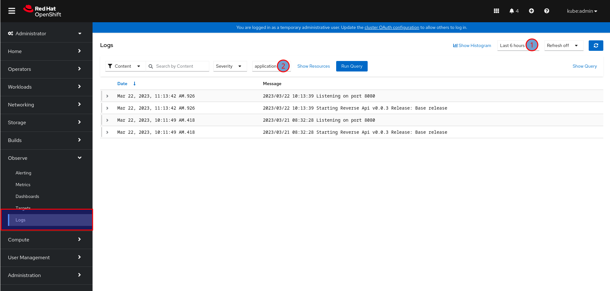
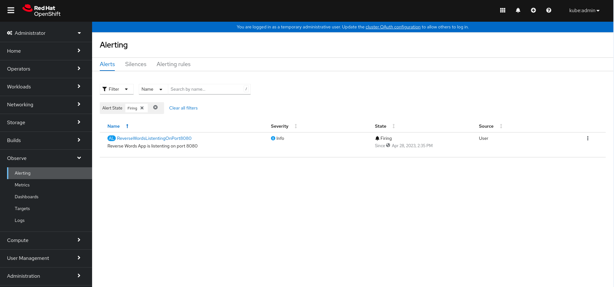
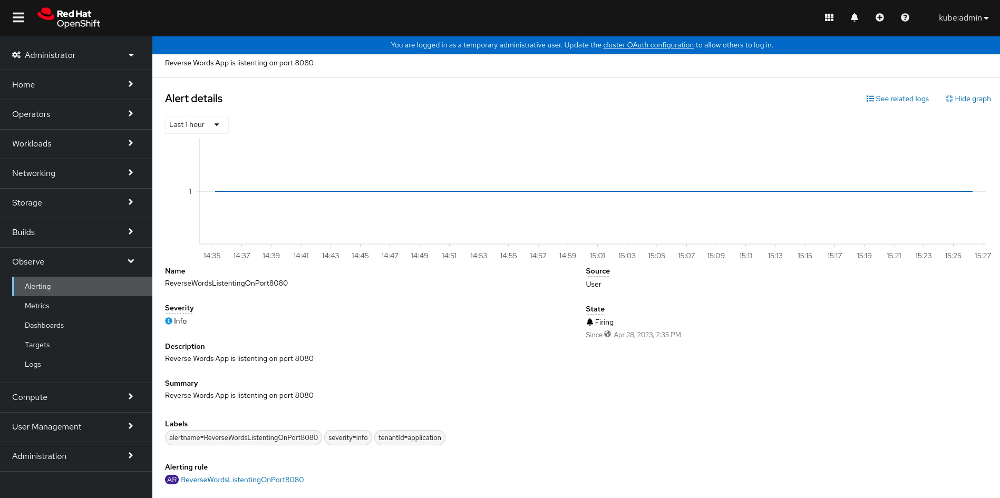
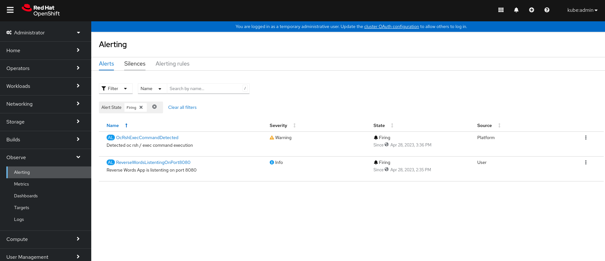
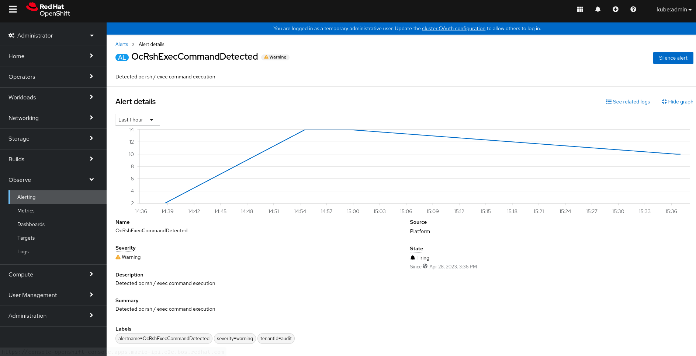

# OpenShift Cluster Logging with the Loki Stack

This doc covers how to deploy the OpenShift Cluster Logging using Vector as the collector and Loki as the log store.

Information in this document is not supported by Red Hat, official docs can be found [here](https://docs.openshift.com/container-platform/4.12/logging/cluster-logging-loki.html).

Versions used:

- OpenShift v4.12
- Cluster Logging Operator v5.7
- Loki Operator v5.7

The end goal is to be able to create alerts from the logs ingested by Loki.

## Required Operators Deployment

Two operators are required, on one hand the Cluster Logging Operator will manage the Cluster Logging subsystem while on the other hand the Loki Operator will manage the Loki subsystem.

All the commands executed below must be run connected to the OpenShift cluster as cluster-admin.

> **NOTE**: We will be deploying the operators from the command line, you can do the same from the OpenShift Web Console.

1. Create the required `Namespaces`:

    ~~~sh
    cat << EOF | oc apply -f -
    ---
    apiVersion: v1
    kind: Namespace
    metadata:
      labels:
        kubernetes.io/metadata.name: openshift-operators-redhat
        openshift.io/cluster-monitoring: "true"
      name: openshift-operators-redhat
    ---
    apiVersion: v1
    kind: Namespace
    metadata:
      labels:
        kubernetes.io/metadata.name: openshift-logging
        openshift.io/cluster-monitoring: "true"
      name: openshift-logging
    EOF
    ~~~

2. Create the required `OperatorGroups`:

    ~~~sh
    cat << EOF | oc apply -f -
    ---
    apiVersion: operators.coreos.com/v1
    kind: OperatorGroup
    metadata:
      nme: openshift-operators-redhat
      namespace: openshift-operators-redhat
    spec:
      upgradeStrategy: Default
    ---
    apiVersion: operators.coreos.com/v1
    kind: OperatorGroup
    metadata:
      name: openshift-logging
      namespace: openshift-logging
    spec:
      targetNamespaces:
      - openshift-logging
      upgradeStrategy: Default
    EOF
    ~~~

3. Create the required `Subscriptions`:

    ~~~sh
    cat << EOF | oc apply -f -
    ---
    apiVersion: operators.coreos.com/v1alpha1
    kind: Subscription
    metadata:
      name: loki-operator
      namespace: openshift-operators-redhat
    spec:
      channel: stable
      installPlanApproval: Automatic
      name: loki-operator
      source: redhat-operators
      sourceNamespace: openshift-marketplace
      startingCSV: loki-operator.v5.7.0
    ---
    apiVersion: operators.coreos.com/v1alpha1
    kind: Subscription
    metadata:
      name: cluster-logging
      namespace: openshift-logging
    spec:
      channel: stable-5.6
      installPlanApproval: Automatic
      name: cluster-logging
      source: redhat-operators
      sourceNamespace: openshift-marketplace
      startingCSV: cluster-logging.v5.7.0
    EOF
    ~~~

## Deploying the Loki stack

Once we have the required operators running, we can go ahead and deploy the Loki subsystem.

1. Loki requires an S3 bucket, we need to provide the credentials for Loki to access it:

    > **NOTE**: In our case we're using a self-hosted S3 server, so we need to provide the CA information as well.

    ~~~sh
    ---
    cat << EOF | oc apply -f -
    apiVersion: v1
    kind: Secret
    metadata:
      name: logging-loki-s3
      namespace: openshift-logging
    stringData:
      access_key_id: <redacted>
      access_key_secret: <redacted>
      bucketnames: loki-storage
      endpoint: https://s3-server.example.com:9002
      region: eu-central-1
    ---
    apiVersion: v1
    kind: ConfigMap
    metadata:
      name: s3-storage-cert
      namespace: openshift-logging
    data:
      ca.pem: |
        -----BEGIN CERTIFICATE-----
        MIIEFzCCAv+gAwIBAgIUSUnRjrxnl7C15oyLHz7e+XzDNTwwDQYJKoZIhvcNAQEL
        .
        .
        .
        uAguTlH9VVsEf5sAYpg+jkXv/wjVpYPSiGwLbG8Wo3qi8ipSBZ32nLr9pg==
        -----END CERTIFICATE-----
    EOF
    ~~~

2. Create the `LokiStack`:

    > **NOTE**: If we look at the configuration you can see different retention configs can be used. Note that we are using the `1x.extra-small` size which is **not** supported (it's meant for demos, like this one).

    ~~~sh
    cat << EOF | oc apply -f -
    ---
    apiVersion: loki.grafana.com/v1
    kind: LokiStack
    metadata:
      name: logging-loki
      namespace: openshift-logging
    spec:
      limits:
        global: 
          retention: 
            days: 5
            streams:
            - days: 2
              priority: 1
              selector: '{kubernetes_namespace_name=~"test.+"}' 
            - days: 5
              priority: 1
              selector: '{log_type="infrastructure"}'
      managementState: Managed
      replicationFactor: 1
      # https://docs.openshift.com/container-platform/4.12/logging/cluster-logging-loki.html#deployment-sizing_cluster-logging-loki
      size: 1x.extra-small
      storage:
        schemas:
        - effectiveDate: "2022-06-01"
          version: v12
        secret:
          name: logging-loki-s3
          type: s3
        tls:
          caName: s3-storage-cert
          caKey: ca.pem
      storageClassName: lvms-vg1
      tenants:
        mode: openshift-logging
      rules:
        enabled: true
        selector:
          matchLabels:
            openshift.io/cluster-monitoring: "true"
        namespaceSelector:
          matchLabels:
            openshift.io/cluster-monitoring: "true"
    EOF
    ~~~

## Configure the OpenShift Cluster Logging subsystem

Now that Loki is up and running, we can go ahead and configure OpenShift to store logs on it. We will use the `ClusterLogging` resource in order to configure that.

1. Now we can create the `ClusterLogging`:

    > **NOTE**: We just set the collector to Vector and pointed to our LokiStack instance as our log store.

    ~~~sh
    cat << EOF | oc apply -f -
    apiVersion: logging.openshift.io/v1
    kind: ClusterLogging
    metadata:
      name: instance
      namespace: openshift-logging
    spec:
      managementState: Managed
      logStore:
        type: lokistack
        lokistack:
          name: logging-loki
      collection:
        type: vector
    EOF
    ~~~

At this point we should have started getting our logs stored in Loki, we can access the OpenShift Web Console and under `Observe` we should find a `Logs` section.

> **NOTE**: If you don't see the `Logs` section you may need to enable the console plugin. Go to `Operators` -> `Installed Operators` -> `Red Hat OpenShift Logging` and on the right menu press on `Console plugin` to enable it.

We can choose the time period (Num 1) and between three different streams (Num 2):

1. `Application`: Logs from user workloads.
2. `Infrastructure`: Logs from the platform.
3. `Audit`: Logs from the Kubernetes auditing subsystem.

### Audit logs

Audit logs are not sent to the logging subsystem by default, in order to enable audit log collection you need to explicitly configure it:

1. Forward all logs to the default log store (Loki):

    > **NOTE**: You must specify all three types of logs in the pipeline: application, infrastructure, and audit. If you do not specify a log type, those logs are not stored and will be lost.

    > **NOTE2**: The internal Loki log store does not provide secure storage for audit logs. Verify that the system to which you forward audit logs complies with your organizational and governmental regulations and is properly secured. The logging subsystem for Red Hat OpenShift does not comply with those regulations.

    ~~~sh
    cat << EOF | oc apply -f -
    apiVersion: logging.openshift.io/v1
    kind: ClusterLogForwarder
    metadata:
      name: instance
      namespace: openshift-logging
    spec:
      pipelines: 
      - name: all-to-default
        inputRefs:
        - infrastructure
        - application
        - audit
        outputRefs:
        - default
    EOF
    ~~~

2. At this point you should see audit logs on the UI.

## Creating Alerts out of our logs

By default, Loki Ruler will send alerts to the local AlertManager instance. In case you want to send alerts to a different AlertManager you can create a `RulerConfig`:

> **NOTE**: Remember you're not required to create the `RulerConfig` below if you plan to use the in-cluster AlertManager.

~~~sh
cat << EOF | oc apply -f -
---
apiVersion: loki.grafana.com/v1beta1
kind: RulerConfig
metadata:
  name: rulerconfig
  namespace: openshift-logging
spec:
  evaluationInterval: 1m
  pollInterval: 1m
  alertmanager:
    discovery:
      enableSRV: true
      refreshInterval: 1m
    enableV2: true
    endpoints:
      - "https://_web._tcp.alertmanager-operated.openshift-monitoring.svc"
    enabled: true
    refreshPeriod: 10s 
EOF
~~~

At this point we are ready to create alerts, we can create two kinds of alerting rules:

1. `AlertingRule`: Alerting rules allow you to define alert conditions based on Prometheus expression language expressions and to send notifications about firing alerts to an external service.
2. `RecordingRule`: Recording rules allow you to precompute frequently needed or computationally expensive expressions and save their result as a new set of time series.

### Creating an Alert out of application logs

In this example we will be creating an alert for one of our applications.

1. Deploy the application

    ~~~sh
    cat <<EOF | oc apply -f -
    ---
    apiVersion: v1
    kind: Namespace
    metadata:
      labels:
        kubernetes.io/metadata.name: reversewords
        openshift.io/cluster-monitoring: "true"
      name: reversewords
    ---
    apiVersion: apps/v1
    kind: Deployment
    metadata:
      creationTimestamp: null
      labels:
        app: reverse-words
      name: reverse-words
      namespace: reversewords
    spec:
      replicas: 1
      selector:
        matchLabels:
          app: reverse-words
      strategy: {}
      template:
        metadata:
          creationTimestamp: null
          labels:
            app: reverse-words
        spec:
          containers:
          - image: quay.io/mavazque/reversewords:latest
            name: reversewords
            resources: {}
    status: {}
    EOF
    ~~~

2. This application shows the following log when it starts:

    ~~~log
    2023/04/20 14:54:30 Starting Reverse Api v0.0.25 Release: NotSet
    2023/04/20 14:54:30 Listening on port 8080
    ~~~

3. We can add an alert when the application starts without a `Release` being set:

    > **NOTE**: The application alerts must be created in the namespace where the app runs. In this case the alert is looking for the content `Listening on port 8080` in the logs for the past 2h. If it finds more than 0 occurrences, an alert will be fired.

    ~~~sh
    cat <<EOF | oc apply -f -
    ---
    apiVersion: loki.grafana.com/v1
    kind: AlertingRule
    metadata:
      name: reversewords-alerts
      namespace: reversewords
      labels:
        openshift.io/cluster-monitoring: "true"
    spec:
      tenantID: "application"
      groups:
        - name: reversewords-app-rules-group
          interval: 20s
          rules:
            - alert: ReverseWordsListeningOnPort8080
              expr: |
                sum(count_over_time({kubernetes_namespace_name="reversewords", kubernetes_pod_name=~"reverse-words-.*"} |= "Listening on port 8080" [2h])) > 0
              for: 10s
              labels:
                severity: info
                tenantId: application
              annotations:
                summary: Reverse Words App is listening on port 8080
                description: Reverse Words App is listening on port 8080
    ~~~

4. At this point we will see this on the Alert UI:

    

5. We can open the alert details as well:

    

### Creating an Alert out of audit logs

We can also create alerts out of platform logs, for example, the following alert could be created to get notified when someone runs `oc rsh` or `oc exec`:

~~~sh
cat <<EOF | oc apply -f -
---
apiVersion: loki.grafana.com/v1
kind: AlertingRule
metadata:
  name: audit-alerts
  namespace: openshift-logging
  labels:
    openshift.io/cluster-monitoring: "true"
spec:
  tenantID: "audit"
  groups:
    - name: audit-rules-group
      interval: 20s
      rules:
        - alert: OcRshExecCommandDetected
          expr: |
            sum(count_over_time({log_type="audit"} |~ "/exec?" [5m])) > 0
          for: 10s
          labels:
            severity: warning
            tenantId: audit
          annotations:
            summary: Detected oc rsh / exec command execution
            description: Detected oc rsh / exec command execution
EOF
~~~

In this case, once it fires this is what we see:

