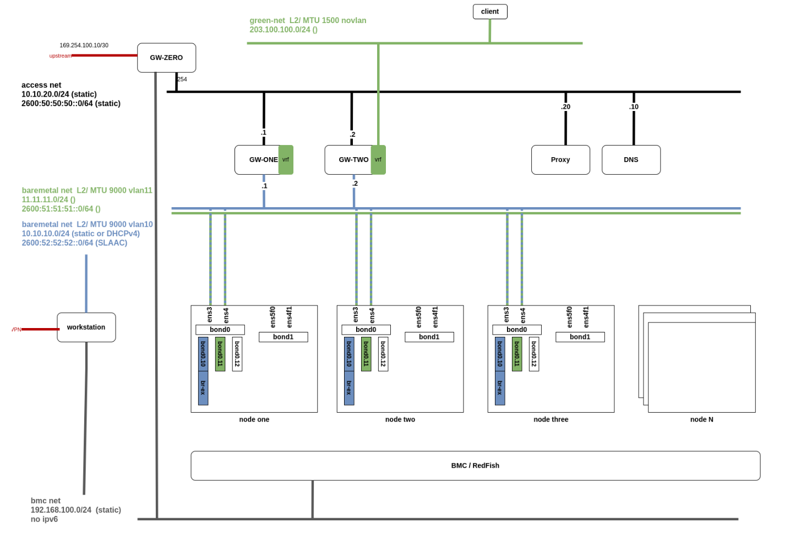

# Agent-based  on virtual infrastructure

POC on OCP v4.12.z with complex network setup

## Network

## Experiment

- Dual stack / Single stack 
- W/o proxy for the connected installation
- RoutingViaHost // local gateway (instead of default shared gateway)
- MTU 9000k
- Bond on the primary interface
- VLANs on top of bond
- Secondary networks
- More than Gateway setup (VRRP)
- Static, DHCPv4, IPv6 SLAAC, DHCPv6
- Operators on day 0 (Metallb, NMState), instance on day 1, config on day 2
- API/VIPs both IPv4/IPv6
- MultiNodes 3x master, 1x+ workers

## Tutorial

Given the virtual environment in place, manually run commands inside the [install-5gc.sh](install-5gc.sh) 
bash script
