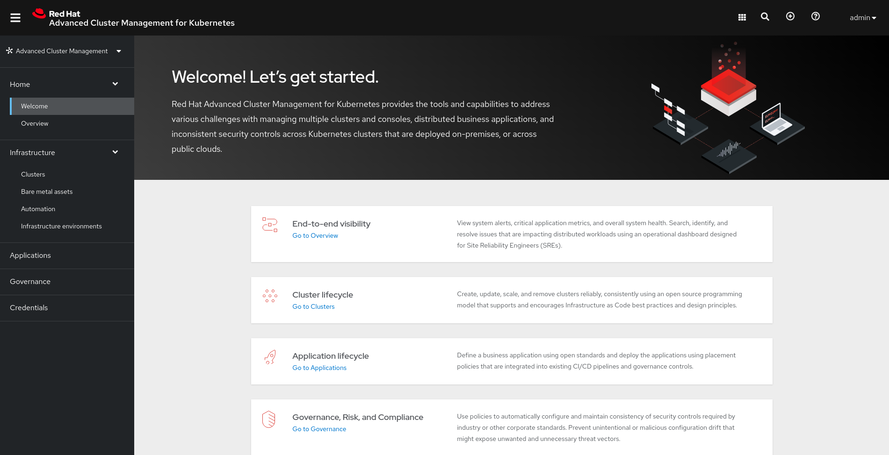
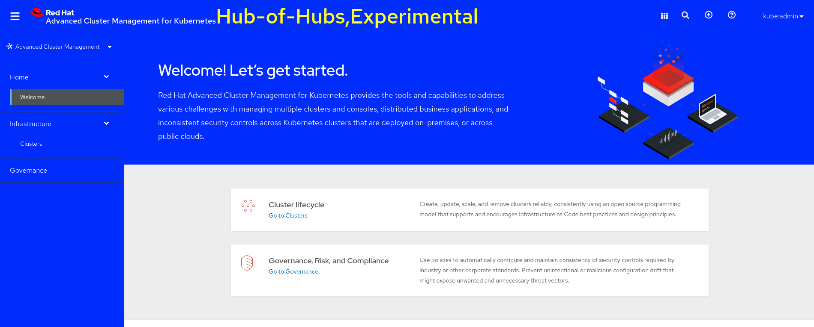
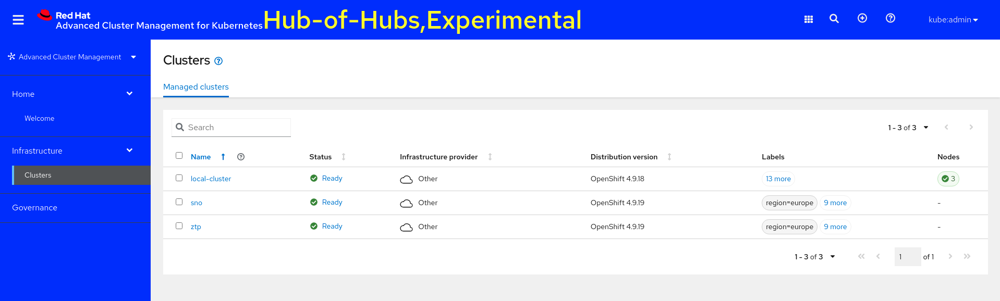
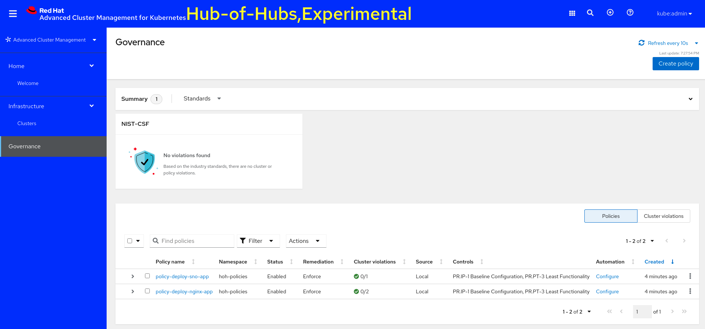

# **Hub of Hubs Preview**

:warning: The work exposed here is not supported in any way by Red Hat, this is the result of exploratory work. Use at your own risk.

## **Requirements**

* 3 x OpenShift Clusters acting as Hub Clusters (We tested with 4.9.19)
* 2 x OpenShift Cluster acting as Managed Cluster (we tested with 4.9.19)
* RH ACM (We tested with 2.4)
* Hub of Hubs [preview code](https://github.com/stolostron/hub-of-hubs/tree/main/deploy) (Tested with tag v0.3.1)

## **Installation of Hub of Hubs**

The current deployment scripts for Hub of Hubs require of some tooling on the machine that will run the scripts:

* Helm v3.7+
* Kubectl
* yq 4+

### **Preparing for deployment**

1. We assume RHACM is already deployed on the HUB cluster that will become Hub of Hubs, this HUB **does not** have any managed cluster attached.

    1. ACM Deployed:

        ~~~sh
        oc -n open-cluster-management get mch
        
        NAME              STATUS    AGE
        multiclusterhub   Running   42m
        ~~~

    2. No managed clusters:

        ~~~sh
        oc get managedclusters

        NAME            HUB ACCEPTED   MANAGED CLUSTER URLS                      JOINED   AVAILABLE   AGE
        local-cluster   true           https://api.hoh.e2e.bos.redhat.com:6443   True     True        35m
        ~~~

2. Clone the HoH repo:

    ~~~sh
    git clone https://github.com/stolostron/hub-of-hubs.git
    ~~~

3. Switch to tag v0.3.1

    ~~~sh
    cd hub-of-hubs/
    git fetch --all --tags
    git checkout tags/v0.3.1 -b v0.3.1-branch
    ~~~

4. Export the `TOP_HUB_CONFIG` env var pointing to the `kubeconfig` file that provides access to the cluster that will be used as Hub of Hubs (Remember that ACM must be running on this cluster).

    ~~~sh
    export TOP_HUB_CONFIG=~/ipi-cluster-hoh/kubeconfig
    ~~~

5. Export the release tag for the container images, in this case we want to use `v0.3.1`:

    ~~~sh
    export TAG=v0.3.1
    ~~~

6. Export the transport protocol you want to use, you can choose between `kafka` or `sync-service`, we will go with kafka:

    ~~~sh
    export TRANSPORT_TYPE=kafka
    ~~~

### **HoH Deployment**

1. We are ready to run the installation, at this point our Hub of Hubs ACM console should look like this:

    

2. Let's run the HoH deployment script

    1. Make sure the env vars are properly set:

        ~~~sh
        env | grep -E "TOP_HUB|TAG|TRANSPORT"
        
        TAG=v0.3.1
        TOP_HUB_CONFIG=/home/kni/ipi-cluster-hoh/kubeconfig
        TRANSPORT_TYPE=kafka
        ~~~

    2. Run the deployment:

        ~~~sh
        cd deploy/
        KUBECONFIG=$TOP_HUB_CONFIG ./deploy_hub_of_hubs.sh
        ~~~

3. After a few moments, the script will finish and your ACM console should look like this:

    

### **HoH Agent Deployment**

Now that we have our Hub of Hubs deployed we need to deploy the HoH agent into our existing Hub clusters, that way we will get them as leaf-hubs.

1. We need to provide the path to the leaf-hub kubeconfig and run the `deploy_hub_of_hubs_agent.sh`. We will run this script in the two Hub clusters we already have in our environment. If we look at these hub clusters they already have managed clusters:

    > LEAF HUB 1

    ~~~sh
    $ oc get managedcluster

    NAME            HUB ACCEPTED   MANAGED CLUSTER URLS                            JOINED   AVAILABLE   AGE
    local-cluster   true           https://api.mario-ipi.e2e.bos.redhat.com:6443   True     True        4d6h
    ztp             true           https://api.ztp.e2e.bos.redhat.com:6443         True     True        4d1h
    ~~~

    > LEAF HUB 2

    ~~~sh
    $ oc get managedcluster
    NAME            HUB ACCEPTED   MANAGED CLUSTER URLS                           JOINED   AVAILABLE   AGE
    local-cluster   true           https://api.ipi-test.e2e.bos.redhat.com:6443   True     True        27h
    sno             true           https://api.sno.e2e.bos.redhat.com:6443        True     True        27h
    ~~~

2. Run the script:

    1. Running the script on leaf hub 1:

        ~~~sh
        export HUB1_CONFIG=~/ipi-cluster/auth/kubeconfig
        KUBECONFIG=$HUB1_CONFIG LH_ID=hub1 ./deploy_hub_of_hubs_agent.sh
        ~~~

    2. Running the script on leaf hub 2:

        ~~~sh
        export HUB2_CONFIG=~/ipi-cluster-test/auth/kubeconfig
        KUBECONFIG=$HUB2_CONFIG LH_ID=hub2 ./deploy_hub_of_hubs_agent.sh
        ~~~

### **Cluster view**

At this point, we should see all our managed clusters (ztp and sno) in this case in the HoH ACM Console. We won't see the leaf-hubs as that's transparent for the user. If we check the ACM console this is what we should see:

### **Policies**

At this point HoH only supports governance, so we will see how we can create policies targeting our managed clusters.

1. Our [first policy](assets/03_policy-app-deploy-sno.yaml) targets our SNO clusters (clusters labeled as `sno: true`).
2. Our [second policy](assets/04_policy-app-deploy-europe.yaml) targets all our managed clusters located in Europe (clusters labeled as `region: europe`).
3. We have a [kustomization](assets/kustomization.yaml) file we can use to create our policies like this:

    ~~~sh
    oc apply -k assets/
    ~~~

This is how our HoH will report the policies:

## **Questions for ACM team**

* Is it possible to use the HoH ACM instance to deploy clusters and get them attached to a leaf-hub? or do clusters need to be deployed from the leaf-hubs?
* Is it possible to deploy leaf-hubs from the HoH? Will those get added as leaf-hubs or as regular managed clusters?
* How can a cluster-admin connected to the HoH via CLI see how many managed clusters are accessible by the HoH? - Will the managed clusters print which leaf-hub they report to?
* In terms of HoH it would be great to have "replicated" leaf-hubs, but that will require ACM to support managed clusters to report to multiple leaf-hubs. We know that HoH is not designed as an HA solution, but without knowing the HoH internals it feels like a potential feature that our customers may ask for.
* Why the policies get duplicated on the leaf-hubs? Wouldn't it be enough with 1? - It seems that you get all existing policies in the HoH replicated to the `hoh-system` namespace, and then those get duplicated to the managed clusters namespaces.

    ~~~sh
    NAMESPACE    NAME                                                  REMEDIATION ACTION   COMPLIANCE STATE   AGE
    hoh-system   policy-deploy-nginx-app-hoh-hoh-policies              enforce              Compliant          4d14h
    hoh-system   policy-deploy-sno-app-hoh-hoh-policies                enforce                                 4d14h
    ztp          hoh-system.policy-deploy-nginx-app-hoh-hoh-policies   enforce              Compliant          4d14h
    ~~~

## **Things not working as expected**

* When trying to add a label to a managed cluster from the HoH console it seems like the label got added, but still the label is not applied to the managed cluster.
* When using the UI to create a policy, on the cluster selector I couldn't find labels from managedclusters on leaf-hubs.
* When using the UI to check the policies we cannot see which managed clusters are targeted by a given policy.
* From the Policies UI user cannot do a bulk deletion of selected policies.
* If a policy is non-compliant you cannot see why it's not compliant.
* We cannot manage the leaf-hubs from the HoH, may be handy having an option to apply policies targeting the leaf-hubs.
* When deleting a policy, content created by the policy gets not deleted from the cluster (I believe this is the same for regular ACM Hub, but may be worth exploring having an option to decide on cascade deletions).
* If you edit a policy in the `hoh-system` namespace on a leaf-hub, changes get applied to the policy copy inside the managed cluster namespace and the change is reconcillated in the managedcluster. Shouldn't the HoH control this kind of drifts?
* If a leaf-hub loses connectivity and some policies get added/deleted those are not synched to the HoH. Should this be possible?
* We were not able to deploy HoH in OCP 4.9, deployment scripts have hard coded stuff that does not exist on OCP 4.9. e.g: AMQ Streams subscription `1.7.x channel does not exists in 4.9`.